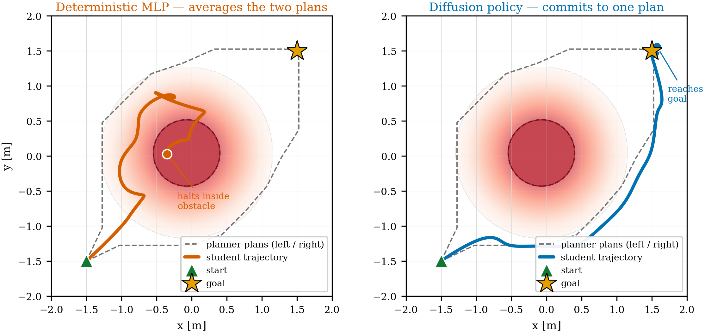
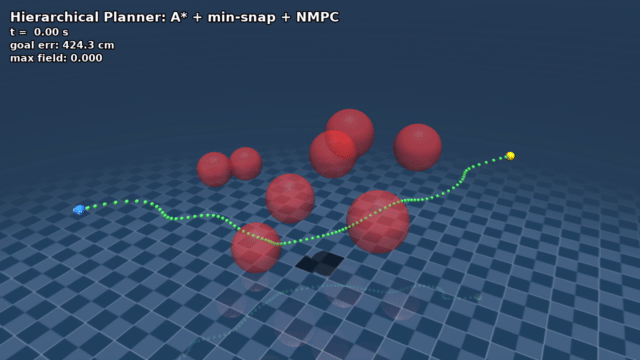
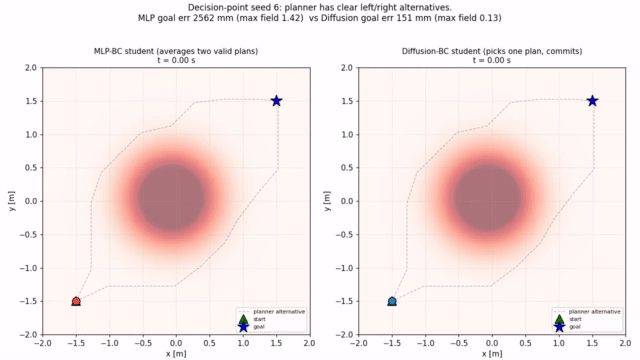
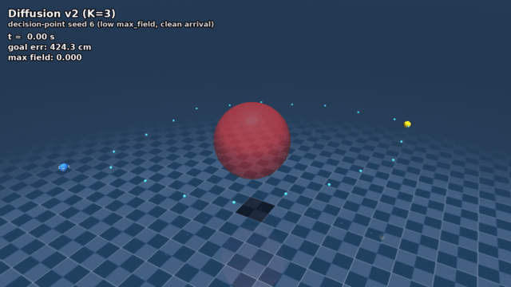
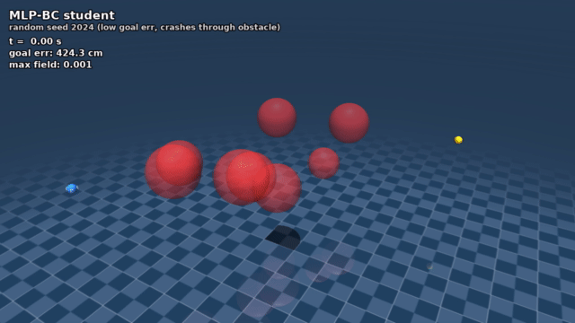
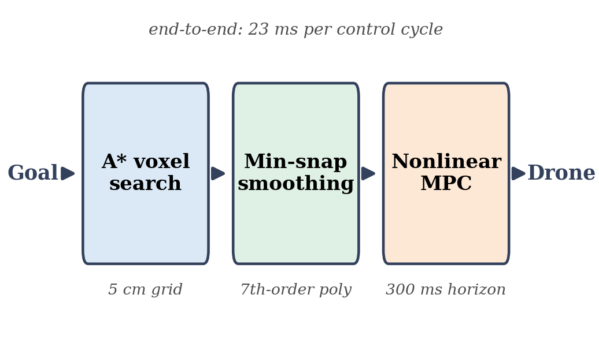
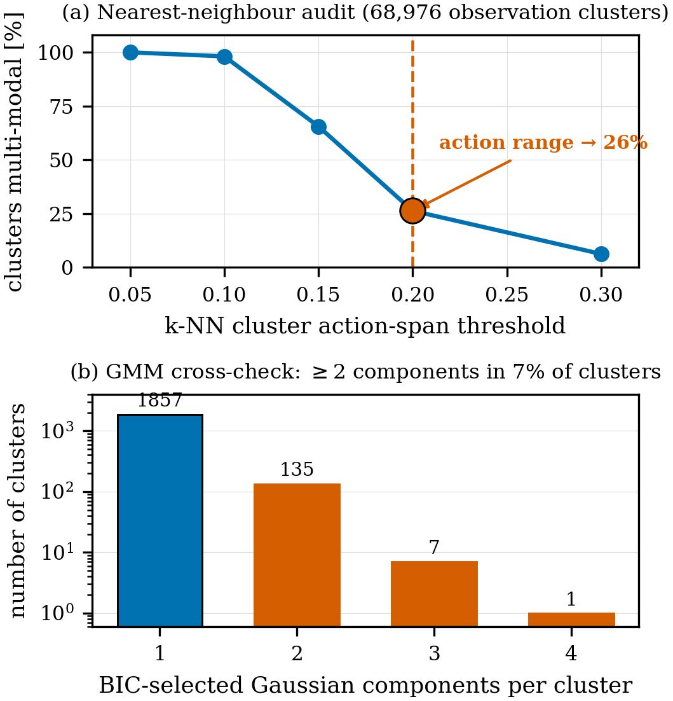
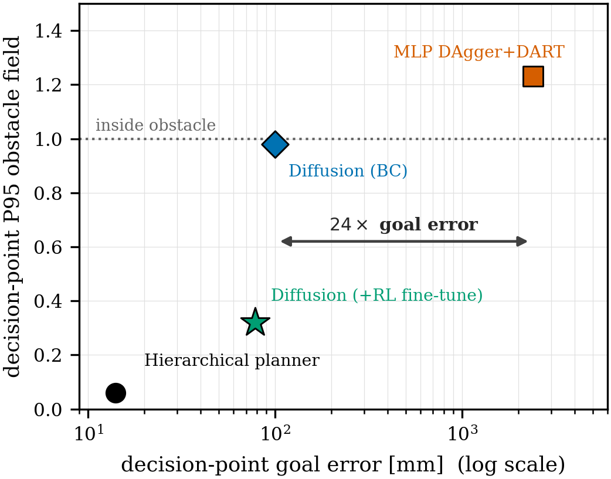
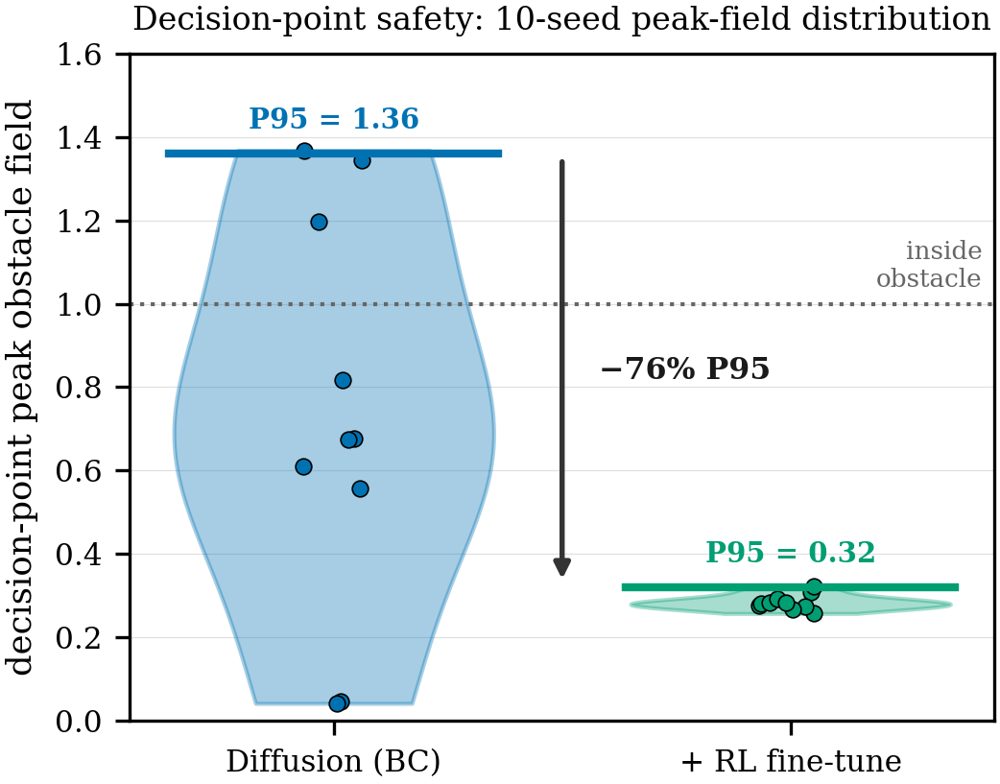

# Distilling a Hierarchical Quadrotor Planner with Diffusion Policies

Distilling an A\* + minimum-snap + nonlinear-MPC obstacle-avoidance planner
into a fast reactive policy. The headline finding: when the planner's
demonstrations are **multi-modal** (an obstacle directly between drone and
goal admits an equally-good left *or* right plan), a deterministic MLP
averages the two and drives **into** the obstacle, while a diffusion policy
samples one coherent plan and navigates **around** it — a 24× goal-error
improvement on decision-point layouts, on the identical dataset.

---

## The result in one image

The same scene, the same observation, two policy classes. The MLP (left)
collapses the bimodal action distribution to its mean — straight into the
obstacle (peak field 1.37). The diffusion policy (right) commits to one
homotopy class and routes around it (peak field 0.03).



---

## Demos

**Planner (teacher) — reference behavior.** The full hierarchical planner
navigating cleanly, 16 mm goal error.



**MLP vs Diffusion — the multi-modality failure and fix.** Side-by-side: the
MLP drives into the obstacle, diffusion goes around.



**Diffusion — clean decision-point navigation.** Diffusion v2 (K=3) weaving
around the central obstacle, peak field 0.03.



**MLP behavior cloning — unsafe baseline.** The deterministic MLP plowing
through obstacles, peak field 1.7.



---

## Method

The teacher is a three-stage hierarchical planner:

1. **Global search** — 3D A\* over a 5 cm voxel occupancy grid with an ESDF.
2. **Smoothing** — minimum-snap polynomial fitting of the A\* waypoints.
3. **Tracking** — a 300 ms-horizon nonlinear MPC on the full 12-D state.



We distill it into reactive students that observe a 24-D reactive input
(state, signed distance, ESDF gradient, 8 forward probes) — deliberately
**excluding** the planner's reference, so the student must infer the
homotopy decision from local geometry and the multi-modality is preserved.

- **MLP** — 24→64→64→4 (~5.7k params), DAgger + DART.
- **Diffusion** — conditional U-Net (~10.8M params), action horizon 8,
  DDPM training / DDIM inference, with a K-sample inference-time safety
  filter that picks the candidate with the largest predicted clearance.

### Why the MLP must fail

The squared-error optimum is the conditional mean of the action
distribution. For a left/right bimodal target, the mean points straight at
the obstacle. This is independent of network capacity — a bigger MLP
estimates the same mean more precisely. Escaping the collapse requires a
**distributional** policy class, which is what diffusion provides.

A nearest-neighbor audit of the dataset finds **26%** of observation
clusters carry an action span wider than the action range — the
multi-modality is intrinsic to the task, not an artifact.



---

## Results

| Controller            | Random goal | Random P95 field | DP goal | DP P95 field | Latency |
|-----------------------|------------:|-----------------:|--------:|-------------:|--------:|
| Planner (teacher)     | 16 mm       | 0.05             | 14 mm   | 0.06         | 23 ms   |
| MLP DAgger+DART       | 846 mm      | 0.25             | 2406 mm | 1.23         | 29 µs   |
| Diffusion (K=3)       | 107 mm      | 0.62             | 100 mm  | 0.98         | 18 ms   |

DP = decision-point layouts (one obstacle between start and goal, forcing a
left/right choice). On these, the MLP is **24× further** from the goal and
its field strength exceeds 1.0 — it is *inside* the obstacle. The diffusion
student reaches the goal.



### Reinforcement fine-tuning (secondary)

Fine-tuning the diffusion student with AWR under a shortest-path reward
improves aggregate safety metrics — 95th-percentile decision-point field
strength down **76%** (1.36 → 0.32), trajectory efficiency from ~0.5 to
0.72. We report this as an aggregate-metric improvement: the fine-tuned
trajectories take non-minimal altitude profiles relative to the planner,
and closing that trajectory-shape gap is future work. The multi-modality
result is the primary claim.



---

## Repository layout

```
planning/        A* + min-snap + NMPC planner (the teacher)
distillation/    dataset collection, MLP and diffusion students, audits
ppo_finetune/    AWR reinforcement fine-tuning of the diffusion student
results/         eval JSONs and metrics
figures/         figures shown in this README
media/           demo videos and stills (see Demos above)
paper/figures/   IEEE paper figures + LaTeX figure snippets
IEEE_paper.tex   IEEE paper source — build: pdflatex IEEE_paper.tex
```

---

## Reproducing the headline result

```bash
conda activate quad_mpc
# collect multi-modal demonstrations
python -m distillation.collect_planner_data
# train both students on the identical dataset
python -m distillation.train_mlp
python -m distillation.train_diffusion
# evaluate on the 20-seed suite (10 random + 10 decision-point)
python -m distillation.four_way_comparison
```

---

## Paper

The full write-up is the IEEE-format manuscript
[`IEEE_paper.tex`](IEEE_paper.tex) (compiled: [`IEEE_paper.pdf`](IEEE_paper.pdf)).
Key claim: *when distilling a planner whose demonstrations are multi-modal,
the policy class — not its capacity — determines success.*
